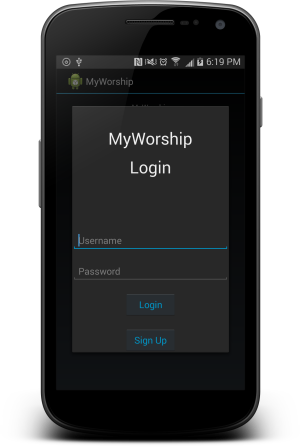
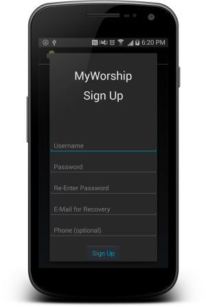

#MyWorship

###Screenshots

This is an application for my local church.
Sign up and Login pages utilize the Dialog Activity. Giving it a 3 dimensional feel. Looking to implement Dialog shadows with the new L version release.
It uses the Parse backend.

##Purpose

The purpose of this app is to be able to track member status during church services.
This eliminates the large amounts of registers needed to manually look through to track attendance.
It will be able to provide accurate analytics of members.